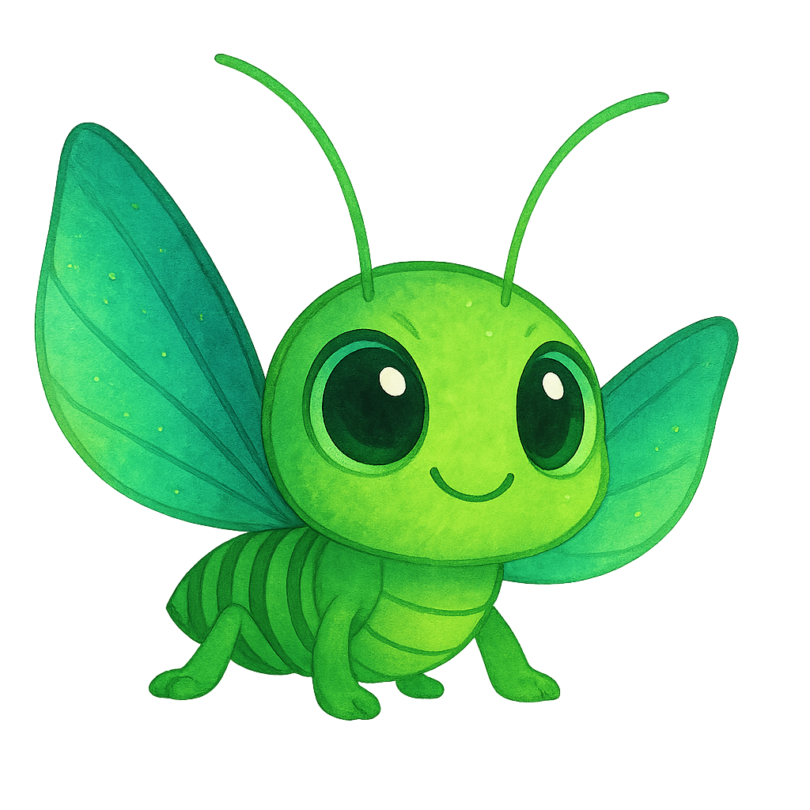

# Write the README.md content to a file in the sandbox so the user can download it.
readme_content = """# LEAPING LANTERNS

## [Play the Game!](https://dillandatanerd.github.io/leaping-lanturns/) <!-- drop in your Netlify / GitHub Pages link -->



---

## Description

*Leaping Lanterns* is an endless-climber where you play a daring cricket hitch-hiking on sky-lanterns during Lunar New Year.  
Time each hop, keep your balance while lanterns drift in the wind, and climb as high as you can before gravity wins. Your distance (shown in metres) becomes your score, and local high-scores let you brag about the best hop-sessions.

---

## Controls

| Action | Keys |
| ------ | ---- |
| Move / face left | **A** or **←** |
| Move / face right | **D** or **→** |
| Jump (while on a lantern) | Tap the move key in your current direction |

---

## Main Functionalities

- **Auto-physics:** Lanterns float up while fuel lasts, then descend; the cricket is pulled by gravity.  
- **Wind drift:** Every lantern has its own lateral wind vector, reversing on screen edges.  
- **Jump chaining:** When the cricket lands, the lantern absorbs it; press a direction again to launch upward.  
- **Dynamic spawning:** Fresh lanterns spawn from below at a constant rate, each with random fuel (height potential) and wind.  
- **Scoring:** Distance climbed increments every frame and is displayed live.  
- **Persistent high-scores:** Top five scores are saved in `localStorage` with player names
- **Only save top 5 high-scores:**  Save is only available if you've got a top 5 score
- **Game states:** Start → Game → Game Over, with seamless transitions and soundtracks.  
- **Responsive audio:** Background music, jump / land SFX, and a splat sound on game-over.  

---

## Backlog / Nice-to-Have Features

- 💥 **Power-ups** (firecrackers for super-jumps, umbrellas for slow-fall).  
- 📱 **Touch controls** for mobile swipes & taps.  
- 🏮 **Lantern varieties**: fragile glass, rocket-boost, zig-zag kites.  
- 🏆 **Online leaderboard** save the scores to compete with everyone.  
- 🖼️ **Scrolling Background** The background should scroll up as you move higher
- 💪**Progressive difficulty increase** The gravity and speed should increase as you move higher up


---

## Technologies Used

- HTML5 + Semantic markup  
- CSS3 (flexbox layout, responsive scaling)  
- Vanilla JavaScript (no external libraries)  
- **DOM manipulation** & custom classes  
- HTML **`<audio>`** for music / SFX  
- **Local Storage** for persistence  
- Lightweight **sprite sheets & PNGs**

---

## Game States

1. **Start Screen** – instructions, background story & *Play now* button  
2. **Game Screen** – gameplay canvas, live score HUD  
3. **Game Over Screen** – final score, high-score submission, *Play again* button  

---

## Project Structure

<details>
<summary><code>/js/main.js</code></summary>

- **Global DOM & audio setup**  
- `startGame()` – initialise cricket + first lantern, kick off loops  
- `gameLoop()` – core update loop (60 FPS)  
- `gameOver()` – detects floor collision, stops loops, shows end screen  
- Utility functions: spawning/despawning, score handling, high-score CRUD, background scroll, etc.
</details>

<details>
<summary><code>/js/cricket.js</code>  — <em>class Cricket</em></summary>

Properties  
`x, y, w, h, gravitySpeed, jumpSpeed, traverseSpeed, ...`

Key methods  
- `automaticMovement()` – applies gravity / wind / vectors  
- `traverse(event)` – lateral move + optional jump  
- `jump()` & vector animations  
- `landed()` and `repositionOnLanturn()` to snap onto platforms
</details>

<details>
<summary><code>/js/lantern.js</code>  — <em>class Lantern</em></summary>

Properties  
`floatSpeed, gravitySpeed, windSpeed, remainingFuel, ...`

Key methods  
- `automaticMovement()` – vertical float / fall + wind drift  
- `burntOut()` – swap lantern image when fuel = 0  and causes gravity to effect lantern
- `absorbCricket()` & `releaseCricket()` handle mounting / dismounting  
- `reverseWind()` – bounce on lateral edges
</details>

Other assets  
- **`/styles/style.css`** – responsive UI & game-box styling  
- **`index.html`** – single-page layout, game containers, asset preload

---

## Folder Layout

project-root/
│
├─ images/ # sprites, background, icons
├─ sounds/ # wav & flac SFX / music
├─ styles/
│ └─ style.css
├─ js/
│ ├─ main.js
│ ├─ cricket.js
│ └─ lantern.js
└─ index.html

### How to Run Locally

```bash
git clone https://github.com/your-repo/leaping-lanterns.git
cd leaping-lanterns
# serve with your favourite dev server
npx live-server .